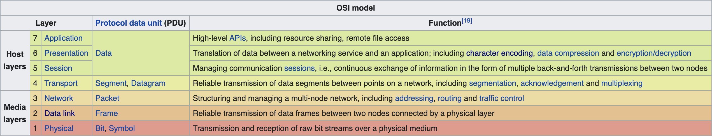

# Open Systems Interconnection Model
 Reference: [Wikipedia](https://en.wikipedia.org/wiki/OSI_model)
 Reference: [TCP vs UDP Crash Course by Hussein Nasser](https://www.youtube.com/watch?v=qqRYkcta6IE&list=PLQnljOFTspQX_Zkt_8teMRsdY4sNt4BX6)

Whichever device connected to the same network will receive the same frames but the network cards of the devices will reject those that are not intended for its MAC address. However, one can sniff frames that are not intended for his MAC address using softwares like Wireshark. If the request is not encrypted at the presentation layer, one can eventually see your entire request by gathering all the frames.