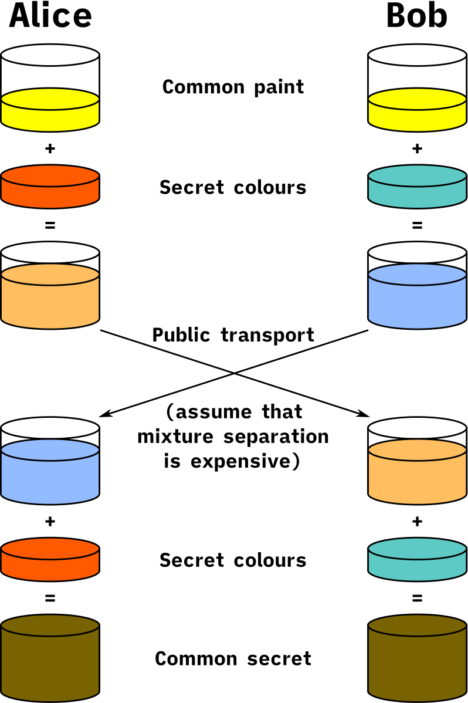
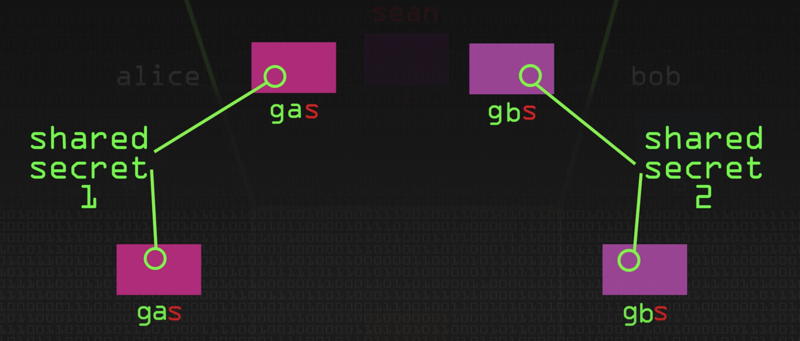

#  Transport Layer Security (TLS)
- Aims primarily to provide privacy and data integrity between client and server
- Connection is private (or secure) because symmetric cryptography is used to encrypt the data transmitted
  - The keys for this symmetric encryption are generated uniquely for each connection and are based on a shared secret that was negotiated at the start of the session - during handshake (before client sends actual GET/POST/... requests to server)

## TLS 1.2
1. Client -> Server: client sends hello
2. Server -> Client: server sends certificate (public key)
3. Client -> Server: client encrypts a symmetric key with server's certificate
4. Server -> Client: server acknowledges (now both client and server has the same symmetric key and can start sending requests/responses to each other - encrypted with the symmetric key)
### Cons
- Slow (4 steps for handshaking)
- Sending symmetric key across to server (in step 2)
  - If someone gets holds of the server's certificate and decrypts this, he can basically decrypt all the subsequent requests/responses

## TLS 1.3
### Pros
- Fast (2 steps for handshaking: client gives server g^a mod p and server gives client g^b mod p)
  - When both client and server has g^(ab) mod p, they basically have a symmetric key and can start sending requests/responses to each other

### Diffie-Hellman Key Exchange
 Reference: [Wikipedia](https://en.wikipedia.org/wiki/Diffie%E2%80%93Hellman_key_exchange)

1. Alice and Bob publicly agree to use a modulus `p = 23` and base `g = 5` (which is a primitive root modulo 23).
2. Alice chooses a secret integer `a = 4`, then sends Bob `A = g^a mod p`
  - `A = 5^4 mod 23 = 4`
3. Bob chooses a secret integer `b = 3`, then sends Alice `B = g^b mod p`
  - `B = 5^3 mod 23 = 10`
4. Alice computes `s = B^a mod p`
  - `s = 10^4 mod 23 = 18`
5. Bob computes `s = A^b mod p`
  - `s = 4^3 mod 23 = 18`
6. Alice and Bob now share a secret (the number 18).

#### Man In The Middle (MITM) Attack
- Diffie-Hellman is still susceptible to MITM attacks
 Reference: [Key Exchange Problems - Computerphile](https://www.youtube.com/watch?v=vsXMMT2CqqE)
1. Alice chooses a secret integer `a`, then sends Bob `g^a mod p`
2. Sean intercepts the message, pretends to be Bob and sends Alice `g^s mod p`
3. Bob chooses a secret integer `b`, then sends Alice `g^b mod p`
4. Sean intercepts the message, pretends to be Bob and sends Alice `g^s mod p`
5. Now Sean has `g^(as) mod p` as shared secret with Alice and `g^(bs) mod p` as shared secret with Bob
6. Alice sends message encrypted with `g^(as) mod p`, Sean decrypts, modifies, reencrypts with `g^(bs) mod p`, and send to Bob

#### Curb MITM with Public Key Cryptography
- Alice hashes `g^a mod p` with her private key before sending to Bob
- Bob applies Alice's public key to the hashed `g^a mod p` and if that worked, it has to be from Alice since only she has her own private key
- Vice versa for Bob